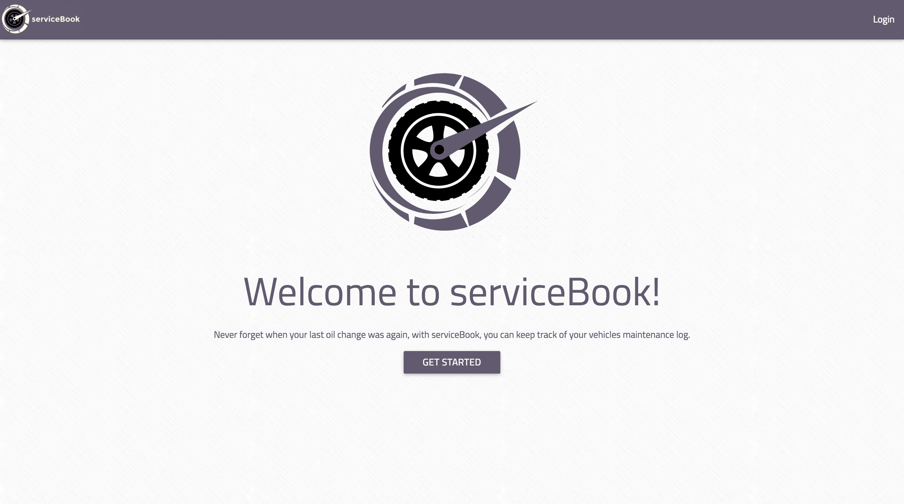
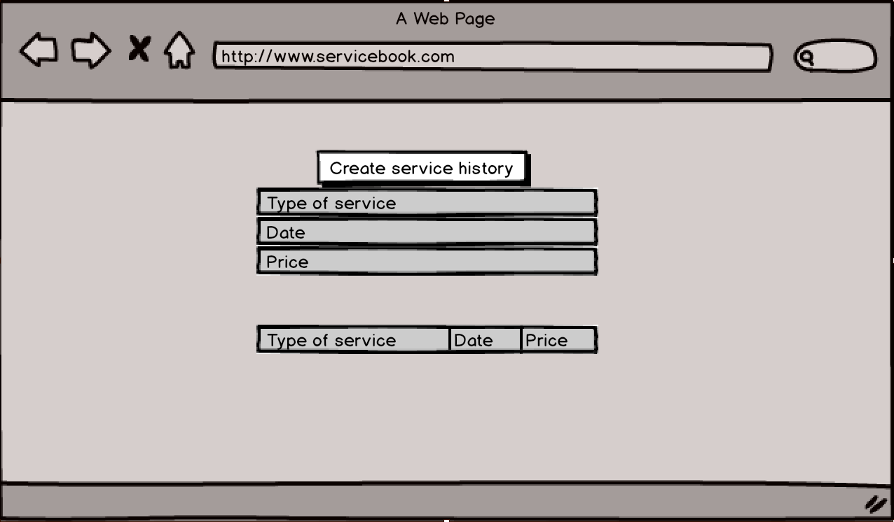
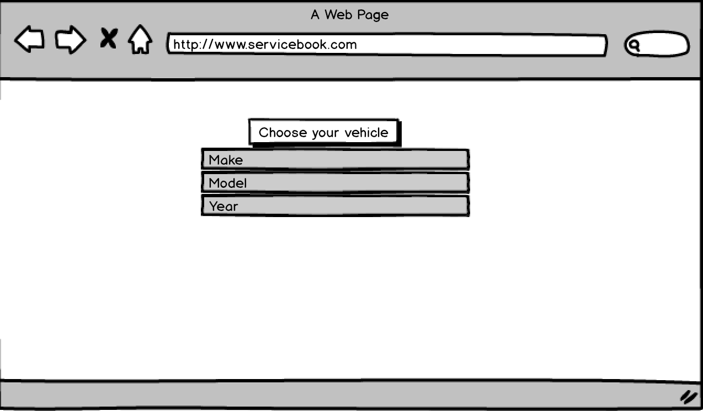

# WDI Project 4: serviceBook

Never forget when your last oil change was again, with serviceBook, you can keep track of your vehicles service log.

### Installation

No installation required, click [here](https://stark-tundra-50325.herokuapp.com/) to acccess the site and get started!

### Project Requirements

The guidelines listed below were provided by the project markdown:

* User of MongoDB and Express to create data CRUD
* Produce a RESTful API that expresses at least one model
* Consume its own API using AJAX
* Authenticate users using at least one OAuth provider
* Restrict access to the Creation, Updating, and Deletion of resources using an authorization middleware function
* Be deployed online using Heroku

Necessary Deliverables

* A working app, hosted somewhere on the Internet
* A client application that consumes its own API, hosted somewhere on the internet
* A link to our hosted, working app in the URL section of our Github repo
* A Git repository hosted on Github, with frequent commits from every team member dating back to the very beginning of the project

### MVP

* A working login page that includes both local and OAuth login options
* A working create account feature that allows users to create a serviceBook account
* The ability for users to create, edit, and delete a profile
* The ability for users to create, edit and delete maintenance logs
* The ability for users to be able to view logs from previously added ones

### Technologies/Frameworks used

* HTML5
* CSS
* JavaScript
* jQuery
* AJAX
* Node.js
* Express.js
* MongoDB.js

**Add to service log**

**Set your vehicle**

### Approach taken

1. I started by drawing out our Wireframes to a diagram and to plan my project.
2. After that, I made a planning board and wrote user stories using Trello.
3. I created models, views, and controllers for this app. Full CRUD was achieved using RESTful routing.
4. Lastly, after all the debugging, the app was deployed to Heroku.

### Future Implementations

* The ability to track future maintenance that is due
* The ability to have a more detailed list of vehicles